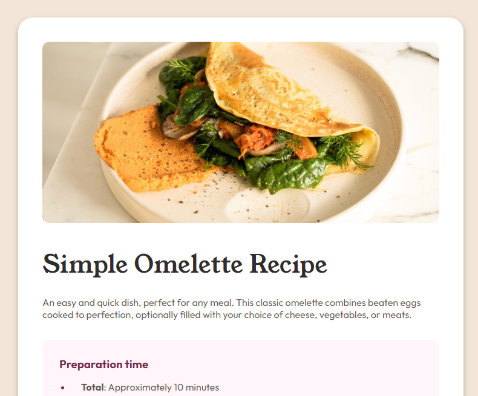

# Frontend Mentor - Recipe page solution

This is a solution to the [Recipe page challenge on Frontend Mentor](https://www.frontendmentor.io/challenges/recipe-page-KiTsR8QQKm). Frontend Mentor challenges help you improve your coding skills by building realistic projects.

## Table of contents

- [Overview](#overview)
  - [Screenshot](#screenshot)
  - [Links](#links)
- [Built with](#built-with)

- [Author](#author)

## Overview

### Screenshot

### Links

- [Solution Repo](https://github.com/morauszkia/fm-recipe-page)
- [Live Site](https://morauszkia.github.io/fm-recipe-page/)

## Built with

- Semantic HTML5 markup
- CSS custom properties
- Flexbox
- Responsive units
- Media queries

## Author

- Frontend Mentor - [@mantis](https://www.frontendmentor.io/profile/morauszkia)
- Github - [@mantis](https://github.com/morauszkia)
- LinkedIn - [András Morauszki](https://www.linkedin.com/in/andras-morauszki/)
